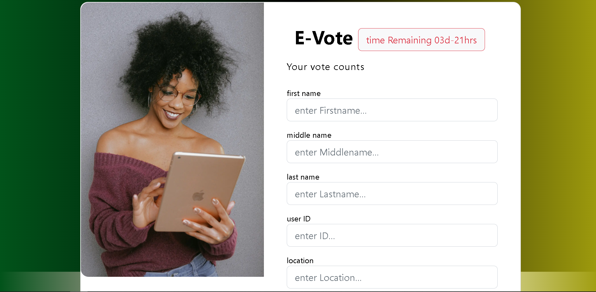

# Vote-App

### This is a repository for our Webstack Portfolio Project


Vote-App is an application that digitizes the voting process done in. Whilst ensuring user privacy and have security to ensure that free and fair elections are conducted.

the ux/ui is designed to apeal to both the new voters who would like a modern vibrant design as well as our senior citizens who would like an interface that's not over whelming.

## Features
### Registration
This voting app was designed to mimick a real life scenario, where users would be required to register with the appropriate institutions in their country before accessing the app to vote. Registration is done by admin accounts on our app.



### Login
Once registered, users can now log in to vote. Our login feature allows authentication of users using flask login authentication. It also ensures users' personal data is protected.


### Vote
Registered voters are allowed to select which candidates they are voting for through our voting feature


## Built with
**Front-End**:

| Tool/Library                                                                       | Version |
| ---------------------------------------------------------------------------------- | ------- |
| [HTML5.0](https://developer.mozilla.org/en-US/docs/Glossary/HTML5)                                      | 3.5.3  |
| [CSS](https://developer.mozilla.org/en-US/docs/Web CSS)                                                      | 16.8.6 |
| [Bootstrap](https://getbootstrap.com/)                                            | 5.1  |
| [Javascript](https://frontarm.com/navi/en/)                                              | 3.0.0  |


**Back-End**:

| Tool/Library                           | Version |
| -------------------------------------- | ------- |
| [Python3](https://www.python.org/)     | 3.5.8    |
| [Flask](https://flask.palletsprojects.com/en/2.1.x/) | 2.1.3     |
| [SQLAlchmey](https://www.sqlalchemy.org/)  | 3.4    |
| [MySQL](https://www.mysql.com/)  | 5.7    |


## Usage/ Installation
clone this repository
```
git clone git@github.com:PyBaker/Webstack-Portfolio-Project.git
cd Webstack-Portfolio-Project
```
run the flask app
```
flask --app web/app run
```

## Authors

* __Shaun__ Email : <DrShaun@gmail.com>
* __Rodney__ Email : <rodney002mwanje@gmail.com> 
* __Beldine__ Email : <beldinemoturi@gmail.com>
